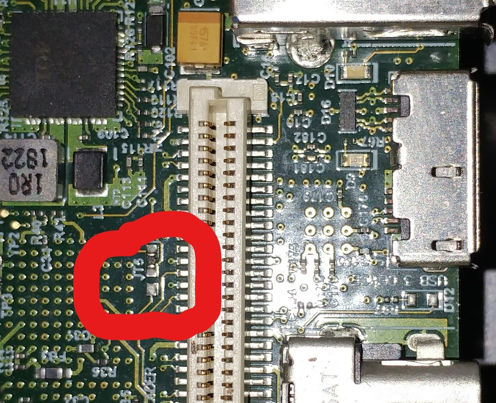

## Prereqs: ##
1. PetaLinux, Xilinx tools 2018.2
2. U96 v2 with zero ohm in following position:

### How to build and attempt wifi launch: ###

1.  Pull xilinx Linux source: git clone https://github.com/FredKellerman/linux-xlnx
2.  cd [linux src repo] then get on branch: git checkout dev_sandeep
3.  In seperate dir, pull bsp repo: git clone https://github.com/FredKellerman/ultra96v2_valtest_2018_2
4.  cd [bsp repo] then get on branch: git checkout dev_sandeep
5.  Then modify config file (CONFIG_SUBSYSTEM_COMPONENT_LINUX__KERNEL_NAME_EXT_LOCAL_SRC_PATH) to point it to your local Linux source:  ultra96v2_valtest_2018_2/project-spec/configs/config (Note: see commit history for example)
6.  petalinux-build
7.  petalinux-package --boot --fsbl images/linux/zynqmp_fsbl.elf --fpga ./images/linux/system.bit --uboot --force
8.  Copy files to SD card
9.  Boot, login (root, root), execute /home/root/wifi.sh
